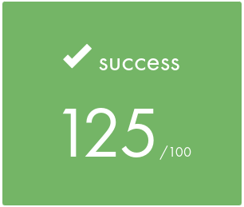

# <div align="center">⚙️ Get next line (a [42](https://42perpignan.fr/) project) ⚙️</div>

**get_next_line** is the fourth project I did for 42 School.

This project teaches us how to read a file, how to use functions like open, close, read. It teaches us to use file descriptors other than 0, 1 and 2 (standard input / output / error output). It also teaches us the use of static variables.

The get_next_line function consists in returning a file content line by line. It can be very useful for future projects, because we'll very often have to get a file content and to store it somewhere. And very often, we need to get only one line of a file.

The bonus consists in using no more than one static variable, and handling mutiple file descriptors in the same time.

# How to use ?
Since it's not a program, you have to include it in your program files. Don't forget to change the includes if needed so it can access to your own header files.
To clone the repository, you can use the following command:
```bash
  git clone https://github.com/Arawyn42/42_get_next_line
```

# Score obtained

